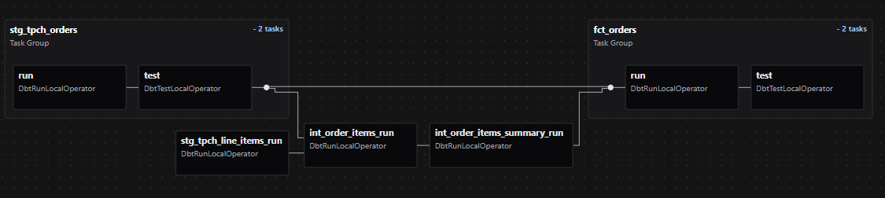
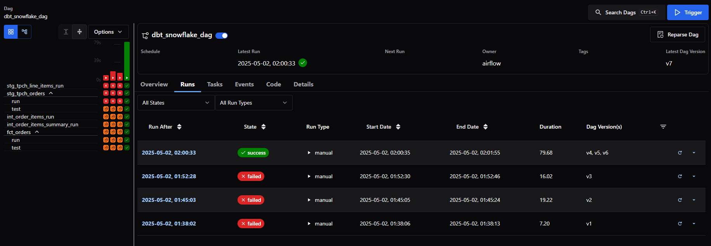

# ELT Pipeline with dbt, Snowflake, and Airflow


A local ELT pipeline using Snowflake's TPCH dataset, dbt for SQL-based transformations, and Apache Airflow (via Astronomer CLI) for workflow orchestration.

---

## Features

- **Local-first ELT**: Built using Dockerized Airflow
- **SQL Transformations**: dbt for modular, testable models
- **Workflow Orchestration**: Apache Airflow via Astronomer CLI
- **Data Quality**: Built-in dbt tests
- **Star Schema Modeling**: Fact and dimension tables

---

## Tech Stack

- **Warehouse**: Snowflake  
- **Transformations**: dbt Core  
- **Orchestration**: Airflow (local)  
- **Modeling**: Star Schema  

---

## Project Structure

```plaintext
.
├── .astro/                       # Astronomer project configs
├── dags/
│   ├── __pycache__/
│   ├── data_pipeline/           # dbt project directory
│   │   ├── analyses/
│   │   ├── dbt_packages/
│   │   ├── logs/
│   │   ├── macros/
│   │   ├── models/
│   │   ├── seeds/
│   │   ├── snapshots/
│   │   │   └── .gitkeep
│   │   ├── target/
│   │   ├── tests/
│   │   ├── .gitignore
│   │   ├── dbt_project.yml
│   │   ├── package-lock.yml
│   │   ├── packages.yml
│   │   └── README.md
│   ├── dbt_dag.py               # Main Airflow DAG definition
│   ├── exampledag.py           # Optional sample DAG
├── images/
│   ├── dbt_dag.png
│   └── dbt_snowflake_dag-graph.png
├── include/                     # Airflow DAG modules (if used)
├── plugins/                     # Custom Airflow plugins
├── tests/                       # Airflow DAG unit tests
├── .dockerignore
├── .env                         # Environment variables
├── .gitignore
├── airflow_settings.yaml        # Airflow connections/variables config
├── Dockerfile
├── packages.txt                 # System packages (used by Dockerfile)
├── README.md                    # Project documentation (root)
├── requirements.txt             # Python dependencies
```


---

## Setup

### Prerequisites

- Snowflake account with TPCH dataset  
- Python 3.8+  
- Docker installed  
- [Astronomer CLI](https://docs.astronomer.io/astro/cli/install-cli)

---

### Installation

```bash
# Install dbt
pip install dbt-core dbt-snowflake

# Initialize dbt project
dbt init data-pipeline

# Set up Airflow locally via Astro CLI
astro dev init

# Start Airflow containers
astro dev start
```

---

### Configure Snowflake

Update `profiles.yml`:

```yaml
data-pipeline:
  target: dev
  outputs:
    dev:
      type: snowflake
      account: <your_account>
      user: <your_user>
      password: <your_pass>
      role: DBT_ROLE
      warehouse: DBT_WAREHOUSE
      database: DBT_DB
      schema: DBT_SCHEMA
      threads: 4
```

> Replace `<your_account>` and other placeholders with your actual Snowflake credentials.

---

## Example Models

**Staging Model**  
`models/staging/stg_orders.sql`:

```sql
SELECT
  o_orderkey AS order_key,
  o_custkey AS customer_key,
  o_orderstatus AS status_code
FROM {{ source('tpch', 'orders') }}
```

**Fact Table**  
`models/marts/fct_orders.sql`:

```sql
SELECT
  orders.*,
  line_items.extended_price,
  {{ discounted_amount('extended_price', 'discount_percentage') }} AS item_discount
FROM {{ ref('stg_orders') }} orders
JOIN {{ ref('stg_line_items') }} line_items
  ON orders.order_key = line_items.order_key
```

**Tests**  
`models/schema.yml`:

```yaml
models:
  - name: stg_orders
    columns:
      - name: order_key
        tests: [unique, not_null]
      - name: status_code
        tests:
          - accepted_values:
              values: ['P', 'O', 'F']
```

---

## Run & Test dbt

```bash
dbt run
dbt test
```

For development flow:

```bash
dbt run --select staging+
dbt docs generate && dbt docs serve
```

---

## Deploy dbt Models to Airflow (Local)

- Make sure your dbt project is copied inside the `dags/` directory
- Start the Airflow environment:

```bash
astro dev start
```

- Add Snowflake connection manually via Airflow CLI:

```bash
docker exec -it <scheduler_container_id> bash
```

Then inside the container:

```bash
airflow connections add 'snowflake_conn' \
    --conn-type snowflake \
    --conn-login 'testuser' \
    --conn-password 'test' \
    --conn-schema 'dbt_schema' \
    --conn-extra '{"account": "snowflake_acc", "database": "dbt_db", "warehouse": "dbt_wh", "role": "dbt_role"}'
```

> Replace with your actual Snowflake values.

---

## DAG Graph View

Here’s the DAG showing dbt model orchestration inside Airflow:



## DAG Pipeline run results




